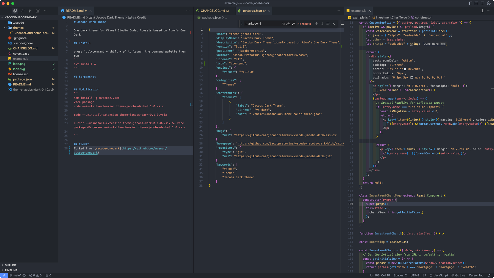

# Jacobs Dark Theme

[](https://marketplace.visualstudio.com/items?itemName=jacob-earth.theme-jacobs-dark) [](https://marketplace.visualstudio.com/items?itemName=jacob-earth.theme-jacobs-dark) [](https://marketplace.visualstudio.com/items?itemName=jacob-earth.theme-jacobs-dark) [](https://github.com/jacobpretorius/vscode-jacobs-dark)

One dark theme for Visual Studio Code, loosely based on Atom's One Dark

## Install

Get it from the [Visual Studio Marketplace](https://marketplace.visualstudio.com/items?itemName=jacob-earth.theme-jacobs-dark).

press `ctl/command + shift + p` to launch the command palette then run
```
ext install = theme-jacobs-dark
```

## Screenshot
Example for JSON & JS




## Modification
```
npm install -g @vscode/vsce
vsce package
code --install-extension theme-jacobs-dark-0.1.0.vsix

code --uninstall-extension theme-jacobs-dark-0.1.0.vsix

cursor --uninstall-extension theme-jacobs-dark-0.1.0.vsix && vsce package && cursor --install-extension theme-jacobs-dark-0.1.0.vsix

```

## Credits
Forked from [vscode-onedark](https://github.com/azemoh/vscode-onedark)